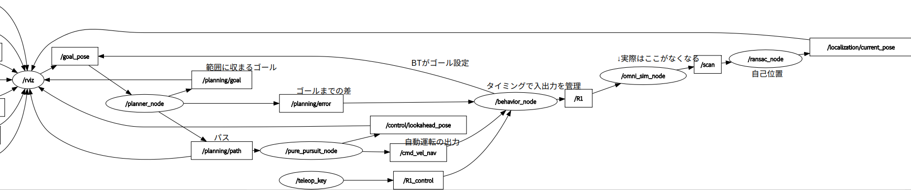

# autorobo.universe

2024NHK高専ロボコン　茨城高専Bチーム

ごじゃっペサーカスR1の制御です。

# important!
ライセンス整備がまだです！

参考：[roboware-neo.universe](https://github.com/TakanoTaiga/roboware-neo.universe)


## ビルド
```bash
$ # cd to your ws
$ cd src
$ git clone https://github.com/kazu-321/autorobo.universe
$ cd ../
$ colcon build
$ source install/setup.bash
```

## 実行
terminal 0

```bash
$ ros2 launch autorobo_launch sim.launch.xml
```

電源オン、navオンの状態で起動します  
子機(サル)などを一通り射出したらGoalを自分で設定できます  
gキーを押して画面をクリックしたらそこへロボットが移動します  
ロボットは常に前を向くようにしています  


### teleopの操作方法
- cキー

        - コンティニュー
        - ロボコンのルールに基づいた遠隔非常停止解除用
- pキー

        - ポーズ
        - サイドコンティニュー(c)すればロボットを動かせる
- waxdキー

        - 4方向移動
        - nav offの状態じゃないと動けない
- sキー

        - ユーザー入力による移動ストップ
- nキー

        - 自動運転のon off切り替え用
        - 最初はon
- oキー

        - 射出許可など自動運転時に安全のためにあるボタン
        - コンティニュー&&自動運転on　ならパスが生成されたりする

## 未検証
- pynputを使用したバックグラウンドキー入力
- rosbag関係のlaunch
- 実際に使用した慣性モデル付きのシミュレーター
- どこまでTFに頼るべきかの実験
- 全方位移動用MPC

## Node Graph

